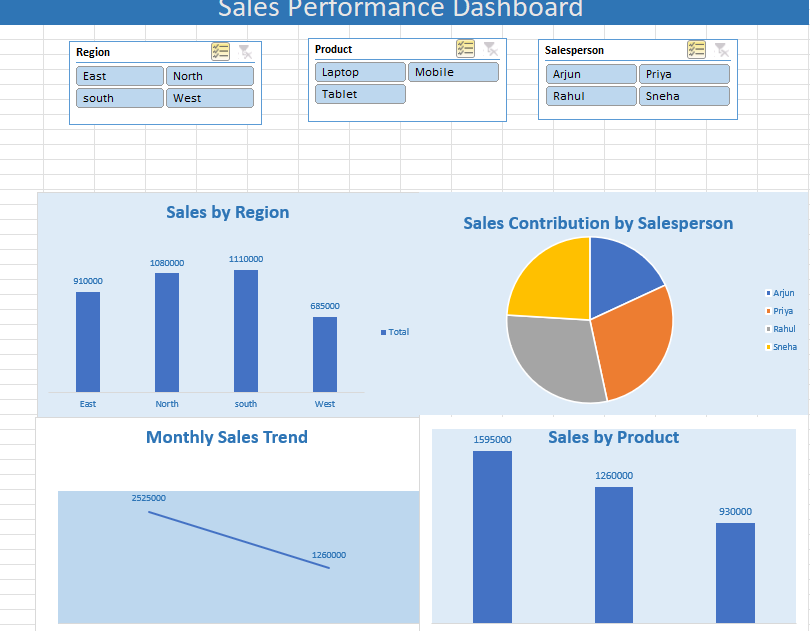

# sales_performance_dashboard_excel
Sales Performance Dasboard created using Microsoft Excel with Pivot Tabkes, charts and Slicers.
# Sales Performance Dashboard (Excel)

## Project Overview
This project presents a Sales Performance Dashboard built using Microsoft Excel.

The dashboard analyzes sales data using Pivot Tables, Charts and Slicers to provide insights into sales performance across regions, products and salespersons.

## Tools Used
- Microsoft Excel
- Pivot Tables
- Pivot Charts
- Slicers

## Dashboard Features
- Sales by Region
- Sales by Product
- Sales by Salesperson
- Monthly Sales Trend
- Interactive Filters using Slicers

## Dashboard Preview

